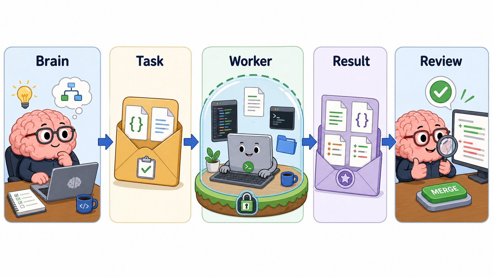

# OpenCode Sidecar

> English: [README.md](skills/opencode-sidecar/README.md)



**强模型负责思考,廉价模型负责干活。**

你在 Claude Code 里跑 Opus 或 GPT——这是房间里最聪明的 agent。但它贵,而且它干的很多事其实是苦力活:读一百个文件只为找一个函数在哪、扫 50KB 日志找真正的报错、对 diff 做第一轮审查。这些不值得你花顶级 token。

这个 skill 让强模型继续当**主脑**——规划、判断、拍板——同时把 token-heavy、边界清晰的活儿甩给更便宜的 OpenCode worker(DeepSeek、MiMo、Qwen,你 auth 过什么都行)。主脑读 worker 的产出,核一遍,再决定下一步。worker 碰不到主工作区。

```
   Claude(主脑)                OpenCode worker(手脚)
   ─────────────                ─────────────────────
   规划 → 委派任务      ──►     explore / review / log
                              ◄──   结构化结论
   审核、综合                   implement / test-fix
   决策、合并            ──►   (在隔离 worktree 里)
                              ◄──   patch(你审核后才 apply)
```

通信走文件,不走对话。每个任务是一个信封(`task.json`),产出一个结果包(`result.md` + `result.json`)。没有 agent 自由发挥,没有上下文丢失,全程可审计。

## 能干什么

- **`explore`** —— "X 在哪处理?"找文件、梳理调用链、画模块结构。只读。
- **`review`** —— 审查当前 diff,找 bug、回归、缺失测试。只读。
- **`log`** —— 扔给它一份报错日志,返回根因假设。只读。
- **`implement`** —— 在**隔离 git worktree** 里做一个小改动,交回 patch,你审核后再 apply。
- **`test-fix`** —— 在 worktree 里修失败测试(优先改生产代码,绝不删测试)。

几个关乎信任的点:

- **worker 是引擎级限权,不是 prompt 级约束。** 只读 worker 在 OpenCode 层就被 `edit: deny`,物理上写不了文件,跟 prompt 怎么说无关。这些 worker 是 OpenCode **primary agent**(`mode: primary`)——因为 `opencode run --agent` 只认 primary,给它 subagent 会静默回退到默认 agent。自己验证:`python scripts/sidecar.py doctor`,或 `OPENCODE_CONFIG_DIR=<skill>/opencode opencode agent list`。
- **可写任务完全隔离。** 强制跑在全新 git worktree 里(`sidecar.py` 写死,碰不到主工作区),只产出 patch,绝不自动合并。
- **两档模型。** 追求速度的活(`explore`、`log`)跑 fast 模型;需要判断力的活(`review`、`implement`、`test-fix`)跑 quality 模型。首次运行会自动探测你 auth 了什么、挑个合理默认,你再确认。

## 安装

```bash
SKILL_BASE_URL=https://github.com/edisoncgh/opencode-sidecar-skill/tree/main \
  npx skill skills/opencode-sidecar
```

会装到 `.codebuddy/skills/opencode-sidecar/`(Claude Code 下为 `.claude/skills/opencode-sidecar/`)。

## 第一次跑:选模型

```bash
cd skills/opencode-sidecar
python scripts/sidecar.py init
```

这会探测 opencode:你 auth 了哪些 provider、有哪些模型可用,然后打印一个自动猜测的 fast/quality 搭配。主 agent(你,或 SKILL.md 指引下的 Claude)据此推荐一对,你拍板:

```bash
python scripts/sidecar.py config set \
  --fast "deepseek/deepseek-v4-flash" \
  --quality "deepseek/deepseek-v4-pro"
```

完事。写入 `.opencode-sidecar.json`(已 gitignore,机器相关)。懒得配也没事——第一个任务会自动探测并写好。

## 用起来

```bash
python scripts/sidecar.py explore --goal "找到 auth token 在哪校验。"
python scripts/sidecar.py review  --scope "当前 git diff"
python scripts/sidecar.py log     --log-file crash.log --goal "根因。"
python scripts/sidecar.py implement --goal "给 user.location 加空值保护。"   # 自动跑在隔离 worktree 里
python scripts/sidecar.py doctor            # 体检:opencode、agent 是否 primary、模型是否就绪
python scripts/sidecar.py check-conflicts   # 并行跑了多个 implement 时,检查 patch 是否撞文件
python scripts/sidecar.py list              # 看所有任务
python scripts/sidecar.py collect --task-id 2026-06-15-001   # 取某任务的结果
```

每个任务落在 `.agent_sidecars/tasks/<id>/`,含 `result.md`、`result.json`、`metadata.json`,可写任务还有 `patch.diff`。**主脑在行动前必须审核结论/patch**——这正是分工的意义。

结果包还会包含轻量能力审计。OpenCode 可能继承用户全局/项目里的 MCP 工具;sidecar 不试图变成完整安全沙箱,而是把 worker 实际用了什么记录下来:工具列表、MCP/自定义工具、类 web 访问、写入类工具、以及是否读了 `.agent_sidecars/` 或 `.git/` 这类内部产物。如果 worker 用了意外工具或读了运行产物,主脑要把它当作审核证据。

`result.json` 会带 `contract_status`: `structured` 表示 worker 输出了可解析且字段符合 sidecar 预期的 JSON block;`fallback` 表示 sidecar 从 Markdown 报告合成了 JSON,并标记低置信度。完整自然语言报告始终保存在 `worker_text.md` / `result.md`。

## 原理(简述)

```
skills/opencode-sidecar/
├── SKILL.md              主 agent 读它来驱动 skill
├── scripts/sidecar.py    编排器(探测、派发、收集)
├── opencode/agents/      5 个 worker agent 定义(mode: primary,带引擎级权限)
├── templates/            task 信封 + result 契约模板
└── schemas/              task.json / result.json 的 JSON schema
```

`sidecar.py` 是唯一的运转部件。每个任务它:原子地认领一个唯一 id(并行任务不会撞车)、写任务信封、通过 `OPENCODE_CONFIG_DIR` 指向 skill 自带的 `opencode/` 目录让 OpenCode 加载 worker agent(不污染你项目的 `.opencode/`,也不动你的 provider/auth 配置)、跑 `opencode run --agent <name> --format json`、把输出实时流式写盘(超时也保留部分结果)、超时时杀整棵进程树(不留孤儿 worker 烧 token)、把 JSON 事件流解析成 `events.jsonl` + `worker_text.md` 再提取结构化结果。可写任务额外加 worktree + patch 导出。就这样——没有 server、没有队列、没有仪表盘。
